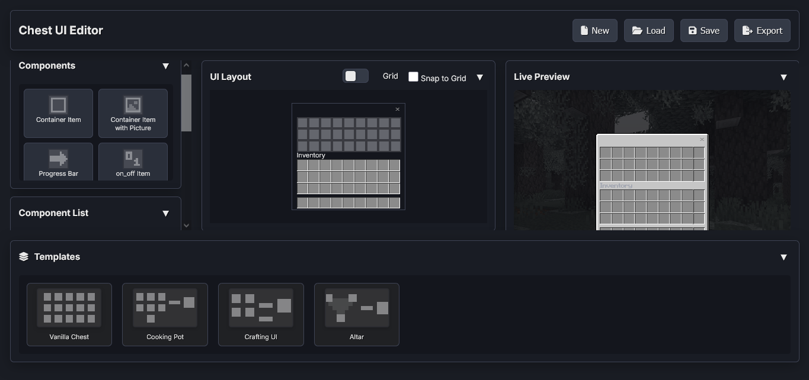

# Minecraft Bedrock Chest UI Editor (Beta)

A web-based editor for creating custom chest UIs for Minecraft Bedrock Edition. Design interactive interfaces with drag-and-drop components, preview in the browser, and export resource packs.

## Features

- Drag-and-drop component placement on a 162×54 canvas (small chest)
- Live editor and preview
- Pre-built templates (vanilla grid, cooking pot, crafting, …)
- **Multiple Chest UIs** in one project (different trigger/display titles per UI)
- **Save / Load** - versioned project in browser storage (`formatVersion: 2`)
- **Import ZIP / Export** - resource pack + `chest_ui_data.json` for sharing and in-game use
- Custom image uploads (packaged under `textures/ui/custom/`)
- Per–Chest UI settings: title, offsets, font scale, dialog background, optional close button
- Mobile-friendly layout (components / editor / preview / templates)

## Components

All draggable components from the palette:

### 1. Container Item

Standard interactive inventory slot bound to `container_items`.

- **Properties:** `collection_index`, position, size
- **Slot textures (optional):** `slot_background_texture`, `slot_selected_texture`, `slot_highlight_texture` (vanilla defaults or custom / uploaded)
- **Use for:** Regular chest slots, machine inputs/outputs

### 2. Container Item with Picture

Interactive slot with a custom background image behind the item.

- **Properties:** `collection_index`, `picture` (texture path), position, size, optional slot textures (same as container item)
- **Use for:** Book slots, filtered inputs, recipe hints

### 3. Progress Bar

Progress indicator driven by the **item name** in the bound slot (after a 6-character prefix).

- **Properties:** `collection_index`, preview `value` (0–9, editor only), position, size
- **In-game:** Rename item so the remainder after the first 6 characters is `0` (empty) through `9` (full)
- **Tip:** Use an unobtainable item in this slot so players cannot shift-click into it

### 4. On/Off Item

Binary toggle driven by item name (after 6-character prefix).

- **Properties:** `collection_index`, preview `active` (editor only), position, size
- **In-game:** Name ending with `1` = on; anything else = off
- **Tip:** Use an unobtainable item in this slot

### 5. Uninteractable Slot (Pot)

Slot with a custom background shape; items can show but interaction is limited compared to a normal slot.

- **Properties:** `collection_index`, `texture` (default `textures/ui/pot/pot`), position, size
- **Tip:** Rename displayed items to random names to reduce shift-click confusion

### 6. Container Type

Interactive slot whose **background** changes from item name (0–9 after 6-character prefix).

- **Properties:** `collection_index`, preview `container_type`, position, size, optional slot textures
- **Tip:** Use an unobtainable item in this slot

### 7. Dynamic Grid

Scrollable grid of slots that uses the collection source instead of hard coded slot index.

- **Properties:** `slot_width`, `slot_height`, `content_height`, `preview_slots` (editor preview count), `scroll_size_width`, scrollbar textures (`scroll_indent_image_texture`, `scrollbar_box_image_texture`, `scroll_background_image_texture`), `show_background`, per-slot textures (`slot_background_texture`, `slot_selected_texture`, `slot_highlight_texture`), position, size
- **Use for:** Scrollable storage UIs, long item lists
- Custom scrollbar images support `user_uploaded:` paths

### 8. Tab

Toggles that can be used to toggle between multiple layouts.

- **Properties:** `toggle_index` (exports as `toggle1`, `toggle2`, …), `toggle_group_name`, textures (borderless light / lightpressednohover / lighthover), optional embedded label or image (same idea as Button)
- **Workflow:** Click a tab to make it active; components placed while it is active get `tab_parent_id` and appear on that tab’s page in-game
- **In-game:** Each tab page is a full-size panel shown/hidden via toggle bindings

### 9. Button

Action button targeting an existing collection index (This is **not** an item slot).

- **Properties:** `target_collection_index`, `pressed_button_name`, default/hover/pressed textures, optional embedded label and image, position, size
- **Actions:** take-all/place-all, take-half/place-one, auto-place, drop-one, drop-all, merge/coalesce stack

### 10. Image

Static decorative image (This is **not** an item slot).

- **Properties:** `texture`, `alpha`, position, size
- Supports uploaded images (`user_uploaded:` → `textures/ui/custom/` on export)

### 11. Label

Static text.

- **Properties:** `text`, `color` (RGB 0–1), `font_scale_factor`, position

### 12. Close Button

Vanilla-style chest close control (`common.close_button`).

- **Properties:** `default_texture`, `hover_texture`, `pressed_texture` (defaults: `close_button_default` / `_hover` / `_pressed`), position, size
- Can also be enabled from **Settings** per Chest UI (`showCloseButton`); the component places it at a custom position with custom textures

## Usage

1. **Components:** Drag from the sidebar onto the canvas; select to edit in the Properties panel.
2. **Chest UIs:** Use the Chest UI manager panel to add UIs with separate trigger titles and display names; switch between them to edit each layout.
3. **Save / Load:** Stores the project in browser storage (version 2). Older saves without `formatVersion: 2` are not loaded - save again or import a new ZIP from this editor.
4. **Import ZIP:** Restores a previously exported pack and project data; updates the browser save.
5. **Export:** ZIP resource pack (UI JSON + textures + `chest_ui_data.json`) or **View as Code** for the generated JSON.
6. **Settings:** Panel height/layer, title text/offset/color/scale, dialog background, close button visibility.
7. **In-game:** Open a container whose title matches the configured display name. Use Script API to fill slots and rename items for progress/on-off/container-type behavior. Match inventory size to your layout (custom entity or vanilla container).

## Developer documentation

- [`CHANGELOG.md`](CHANGELOG.md) - version history and release notes
- [`workspace-documentation.md`](workspace-documentation.md) - architecture, JSON UI patterns, persistence
- [`how_to_add_new_component.md`](how_to_add_new_component.md) - checklist for new components

## Credits

- Created by minato4743
- [JSZip](https://stuk.github.io/jszip/) for ZIP generation
- [Blockstate Team](https://blockstate.team) - cooking pot UI reference from [furniture-venture-v2](https://blockstate.team/projects/furniture-venture-v2) (originally [Farmer's Delight](https://modrinth.com/mod/farmers-delight))
